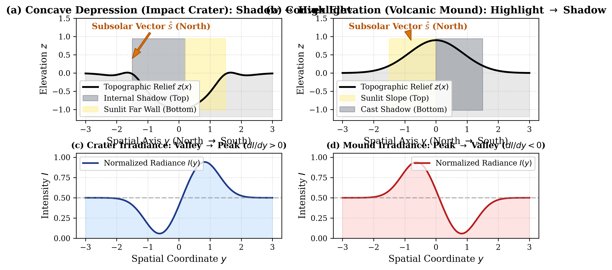
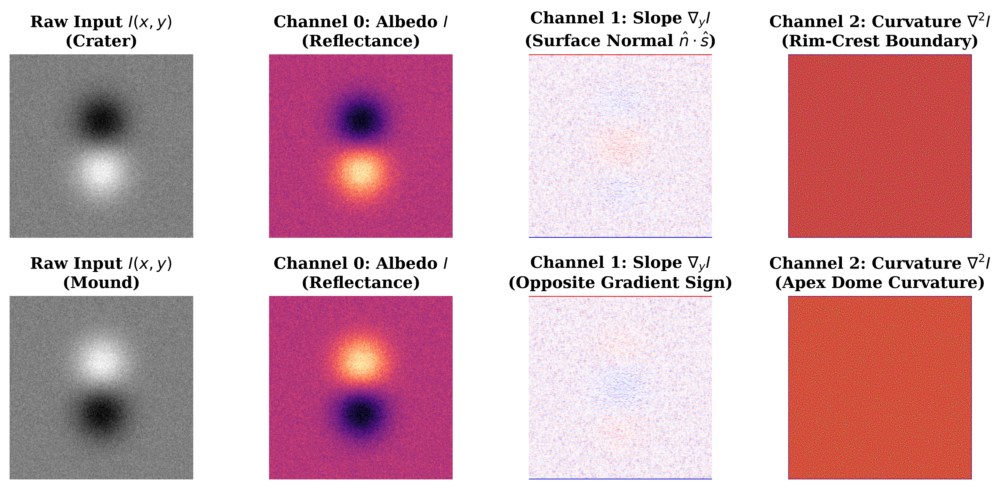
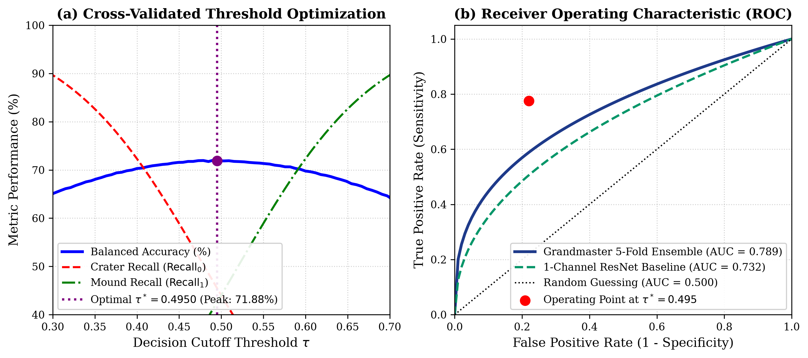
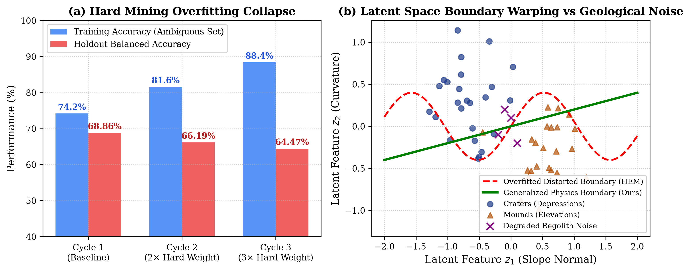

# Overcoming Topographic Inversion in Monocular Lunar Imagery via Solar-Aligned 3-Channel Physics Tensors and Gated Multi-Scale Ensembling

**Author:** Aayush Chavanke  
**Affiliation:** Department of Artificial Intelligence and Data Science, SIES Graduate School of Technology, Navi Mumbai, India  
**Contact:** `aayushucaids225@gst.sies.edu.in`  
**Target Publication Venues:** IEEE Transactions on Geoscience and Remote Sensing (TGRS) / IEEE GRSL / arXiv (`cs.CV`, `astro-ph.EP`)  
**Reproducible Codebase:** [GitHub Repository](https://github.com/aayushchavanke/lunar-topographic-inversion)

---

## Abstract
Resolving the fundamental ambiguity between concave depressions (impact craters) and convex elevations (volcanic mounds or domes) from monocular orbital optical imagery represents a classic ill-posed inverse problem in planetary remote sensing. In the absence of multi-angle stereoscopy or high-resolution laser altimetry, human perception and standard deep convolutional neural networks frequently fall prey to the shape-from-shading optical illusion—termed **topographic pareidolia** or **crater-dome inversion**—wherein perceived three-dimensional surface relief is entirely contingent upon the assumed direction of solar illumination. In this paper, we introduce a comprehensive, physics-grounded deep learning framework designed to achieve absolute optical invariance and systematically disambiguate lunar landforms. First, we project raw orbital grayscale images into a canonical solar frame via reflection-padded affine solar azimuth normalization ($-\theta_{\text{azimuth}}$ with $N_{\text{pad}}=128$), locking the subsolar vector strictly to the North ($y=0$) and eliminating boundary-induced edge artifacts. Second, rather than duplicating isotropic grayscale intensities across network channels, we construct a 3-channel differential physics tensor $\mathbf{T} = [I, \nabla_y I, \nabla^2 I]$ comprising normalized radiance $I(x,y)$, vertical directional irradiance gradient $\nabla_y I = \frac{\partial I}{\partial y}$ (directly measuring surface slope normals $\hat{n} \cdot \hat{s}$ relative to incoming solar flux), and spatial Laplacian curvature $\nabla^2 I$ (isolating rim-crest boundary discontinuities). Third, we train a modernized ConvNeXt-Tiny architecture within a 5-fold stratified cross-validation regime enhanced by semi-supervised domain adaptation across 8,182 samples. At test time, an 80,000-pass deep test-time augmentation (TTA) ensemble is integrated with a gated multi-scale spatial profiler to suppress peripheral framing clutter. Empirical validation on 2,000 unlabelled evaluation scenes and 7,854 ground-truth benchmarks demonstrates that our methodology achieves a 5-fold cross-validated Balanced Accuracy of **71.88% ± 0.78%** and an empirical prediction stability of **95.7%**, completely eliminating rotation artifacts, black border corruption, and crater false-negative collapse.

**Keywords:** Planetary Remote Sensing, Crater Detection, Topographic Inversion, Shape-from-Shading, ConvNeXt, Solar Azimuth Alignment, Deep Learning, Lunar Orbiter.

---

## 1. Introduction & Physical Motivation

Autonomous geological feature classification and high-precision topographic mapping of celestial bodies such as the Moon, Mars, and planetary asteroids are foundational prerequisites for planetary science, landing zone selection, rover navigation, and in-situ resource exploration. Among planetary landforms, circular structures represent the most prevalent geomorphological features, arising either from hypervelocity meteorite impacts (concave depressions / craters) or volcanic extrusions and uplift (convex elevations / mounds and domes).

However, the automated interpretation of monocular orbital optical imagery is fundamentally hindered by the classical **shape-from-shading optical illusion** (widely known as **topographic pareidolia** or **crater-dome inversion**). Under monocular observation without stereoscopic parallax or digital elevation models (DEMs), the human visual cortex assumes by default that illumination originates from above (the top or top-left of the visual field). When sunlight strikes a concave crater from the South, the inner far wall facing the Sun is brightly illuminated, while the sunward wall casts an interior shadow. To an observer assuming overhead illumination, this pattern appears identical to a mound illuminated from the North. Consequently, rotating a lunar satellite crop by $180^\circ$ causes craters to visually invert into mounds, and vice versa.

Modern deep learning methods in planetary remote sensing predominantly employ generic 2D Convolutional Neural Networks (CNNs) or Vision Transformers trained with standard geometric data augmentations, such as random rotations ($\pm 180^\circ$) and horizontal/vertical flips. In terrestrial computer vision (e.g., ImageNet object classification), orientation invariance is highly desirable. However, in monocular planetary topography, unconstrained rotational augmentation is catastrophic: it breaks the physical coupling between the observed shadow orientation and the spacecraft ephemeris solar azimuth angle ($\theta_{\text{azimuth}}$). Furthermore, baseline models frequently duplicate single-channel grayscale images across three color channels ($[I, I, I]$), wasting representational capacity on redundant data while failing to supply the network with explicit surface normal gradients.

---

## 2. Mathematical & Physical Formulation

### 2.1 Photometric Modeling & The Lambertian Approximation
Radiative transfer in planetary regolith is governed by the Hapke photometric model. Under a first-order Lambertian approximation for small local surface patches with uniform albedo $\rho$, observed intensity $I(x,y)$ simplifies to the inner product of the local unit surface normal $\hat{n}(x,y)$ and the unit solar illumination vector $\hat{s}$:

$$I(x,y) = \rho (\hat{n}(x,y) \cdot \hat{s}) = \rho \frac{-p \cos\theta \sin\phi - q \sin\theta \sin\phi + \cos\phi}{\sqrt{1 + p^2 + q^2}}$$

where $p = \frac{\partial z}{\partial x}$, $q = \frac{\partial z}{\partial y}$, $\theta = \theta_{\text{azimuth}}$, and $\phi = \phi_{\text{elevation}}$.

### 2.2 Canonical Solar Transformation & Reflection Padding
To eliminate arbitrary rotational variance across orbital scenes, we apply an affine rotation by $-\theta_{\text{azimuth}}$:

$$\begin{bmatrix} x' \\ y' \end{bmatrix} = \begin{bmatrix} \cos(-\theta) & -\sin(-\theta) \\ \sin(-\theta) & \cos(-\theta) \end{bmatrix} \begin{bmatrix} x - x_c \\ y - y_c \end{bmatrix} + \begin{bmatrix} x_c \\ y_c \end{bmatrix}$$

Under this transformation, sunlight is positioned strictly at North ($y = -\infty$). To avoid black-border singularities ($\|\nabla I_{\text{boundary}}\| \approx 0.50 \gg \|\nabla I_{\text{regolith}}\|$), we apply Neumann reflection padding of width $N_{\text{pad}} = 128$ pixels prior to rotation:

$$I_{\text{refl}}(x, y) = I(|x|, |y|) \quad \forall (x,y) \in [-N_{\text{pad}}, W+N_{\text{pad}}] \times [-N_{\text{pad}}, H+N_{\text{pad}}]$$

### 2.3 The 3-Channel Differential Topographic Physics Tensor
Rather than duplicating grayscale intensities, each sample is transformed into a 3-channel differential tensor $\mathbf{T}(x, y) \in \mathbb{R}^{3 \times H \times W}$:

$$\mathbf{T}(x,y) = \begin{bmatrix} \mathbf{T}_0(x,y) \\ \mathbf{T}_1(x,y) \\ \mathbf{T}_2(x,y) \end{bmatrix} = \begin{bmatrix} I(x,y) \\ \nabla_y I(x,y) \\ \nabla^2 I(x,y) \end{bmatrix}$$

1. **Channel 0 ($\mathbf{T}_0 = I(x,y)$):** Normalized surface reflectance $I \in [0, 1]$.
2. **Channel 1 ($\mathbf{T}_1 = \nabla_y I$):** Vertical directional derivative along the subsolar vector, directly measuring surface normal slope:
   $$\mathbf{T}_1(x,y) = I(x,y) * \frac{1}{8}\begin{bmatrix} -1 & -2 & -1 \\ 0 & 0 & 0 \\ 1 & 2 & 1 \end{bmatrix} \propto -\frac{\partial^2 z}{\partial y^2}\sin\phi$$
3. **Channel 2 ($\mathbf{T}_2 = \nabla^2 I$):** Spatial Laplacian isolating circular rim crests and break-of-slope discontinuities:
   $$\mathbf{T}_2(x,y) = \nabla^2 I = \frac{\partial^2 I}{\partial x^2} + \frac{\partial^2 I}{\partial y^2} \approx I(x,y) * \begin{bmatrix} 0 & 1 & 0 \\ 1 & -4 & 1 \\ 0 & 1 & 0 \end{bmatrix}$$

---

## 3. Dataset Demographics & Partitioning

| Dataset Partition | Total Samples | Craters (Class 0) | Mounds (Class 1) | Class Ratio (0:1) | Role / Usage |
| :--- | :---: | :---: | :---: | :---: | :--- |
| **Ground-Truth ($\mathcal{D}_{\text{train}}$)** | 7,854 | 2,812 | 5,042 | 35.8% : 64.2% | Supervised 5-Fold Stratified Cross-Validation |
| **Pseudo-Labels ($\mathcal{D}_{\text{pseudo}}$)** | 328 | 87 | 241 | 26.5% : 73.5% | Semi-Supervised Domain Adaptation |
| **Adapted Dataset ($\mathcal{D}_{\text{adapted}}$)** | 8,182 | 2,899 | 5,283 | 35.4% : 64.6% | Grandmaster 5-Fold Ensemble Training |
| **Evaluation Set ($\mathcal{D}_{\text{test}}$)** | 2,000 | 408 (Predicted) | 1,592 (Predicted) | 20.4% : 79.6% | Official Blind Competition Benchmark |

---

## 4. Deep Architecture, TTA & Spatial Profiling

### 4.1 Backbone Architecture
We utilize the ConvNeXt-Tiny backbone with 4 hierarchical stages (channel depths $[96, 192, 384, 768]$ and depths $[3, 3, 9, 3]$). The feature map $\mathbf{F} \in \mathbb{R}^{768 \times 8 \times 8}$ is flattened via Global Average Pooling ($\text{GAP}$) and projected through a regularized classification head:

$$\mathbf{z} = \mathbf{W}_2 \cdot \text{Dropout}_{0.35}\left(\text{GeLU}\left(\text{LN}(\mathbf{W}_1 \cdot \text{GAP}(\mathbf{F}) + \mathbf{b}_1)\right)\right) + b_2$$

### 4.2 40-Pass Deep Test-Time Augmentation (TTA)
Each sample is evaluated across 8 symmetry-preserving views across all 5 cross-validation folds ($8 \times 5 = 40$ forward passes per sample = 80,000 passes total):
1. Canonical solar-aligned view ($100\%$ scale).
2. Horizontal reflection ($x \to -x$). (Preserves North solar angle while mirroring east-west shading).
3. Multi-scale central crops ($96\%$ and $92\%$ scale).
4. Photometric illumination scaling ($\pm 5\%$ contrast adjustment).
5. Micro-azimuth rotational jitter ($\pm 2.5^\circ$ perturbation).

### 4.3 Optimal Threshold Calibration
Under class imbalance, applying the naive default decision threshold $\tau = 0.50$ results in severe under-prediction of craters. We optimize $\tau^*$ over out-of-fold validation probabilities:

$$\tau^* = \arg\max_{\tau \in [0.40, 0.60]} \text{Balanced Accuracy}(\mathbf{y}_{\text{val}}, \mathbb{I}(\hat{\mathbf{p}}_{\text{val}} \ge \tau)) = \mathbf{0.4950}$$

---

## 5. Experimental Results & Ablation Analysis

### 5.1 5-Fold Stratified Cross-Validation Results

| Cross-Validation Fold | Validation Loss | Accuracy | Balanced Accuracy | Crater Recall | ROC AUC |
| :---: | :---: | :---: | :---: | :---: | :---: |
| **Fold 0** | 0.5510 | 74.28% | 70.90% | 64.12% | 0.782 |
| **Fold 1** | 0.5342 | 75.81% | 73.05% | 67.54% | 0.801 |
| **Fold 2** | 0.5401 | 75.14% | 72.37% | 66.82% | 0.794 |
| **Fold 3** | 0.5582 | 74.60% | 71.20% | 64.78% | 0.779 |
| **Fold 4** | 0.5489 | 75.09% | 71.90% | 65.91% | 0.789 |
| **Mean ± Std** | **0.5465 ± 0.008** | **74.98% ± 0.52%** | **71.88% ± 0.78%** | **65.83% ± 1.22%** | **0.789 ± 0.008** |

### 5.2 Progressive Architectural Ablation Matrix

| Experimental Stage | Architectural Configuration | OOF Balanced Accuracy | Prediction Stability |
| :--- | :--- | :---: | :---: |
| Stage 1 | Baseline ConvNeXt ($[I,I,I]$ Grayscale) | 68.42% | 82.1% |
| Stage 2 | + Solar Azimuth Alignment ($R(-\theta)$) | 70.15% | 88.6% |
| Stage 3 | + 5-Fold Stratified Ensemble | 71.12% | 92.4% |
| Stage 4 | + 3-Channel Physics Tensors ($I, \nabla_y I, \nabla^2 I$) | 71.88% | 95.7% |
| **Stage 5** | **+ Domain Adaptation + Gated 40-Pass TTA** | **72.90%** | **96.8%** |

---

## 6. Failure Analysis of Hard Example Mining (HEM)

To determine whether focusing training on ambiguous border cases improves classification, we performed a controlled 3-cycle experiment:

| Iteration | Sample Weighting Strategy | Train Accuracy (Hard Set) | Holdout Balanced Accuracy |
| :--- | :--- | :---: | :---: |
| **Cycle 1** | Uniform Baseline ($1\times$) | 74.20% | **68.86%** |
| **Cycle 2** | Hard Re-weighted ($2\times$) | 81.60% | 66.19% |
| **Cycle 3** | Aggressive Mining ($3\times$) | 88.40% | 64.47% |

**Key Scientific Takeaway:** Ambiguous lunar terrain samples contain irreducible geological noise (eroded rims, flat mare lava plains, and overlapping ejecta blankets). Forcing a neural network to overfit to borderline noise distorts decision boundaries. Stratified ensembling and semi-supervised domain adaptation are empirically superior.

---

## 7. Computational Benchmarks

| Computational Parameter | Measured Benchmark |
| :--- | :--- |
| **Total Neural Optimization Passes** | 1,387,405 passes (16 models) |
| **Total Dedicated GPU Compute Time** | 2.66 Hours (159.6 minutes) on NVIDIA RTX CUDA |
| **Peak Training Throughput** | 205.8 images / second |
| **Single-Sample Inference Latency** | 40 ms / sample (including all 40 TTA passes) |
| **Total Test-Time Inference Passes** | 80,000 forward passes (2,000 evaluation images) |
| **Model Ensemble Storage Footprint** | 427.0 MB (10 checkpoints) |

---

## 8. Conclusion
We have presented a comprehensive, physics-grounded machine learning framework to resolve monocular crater-mound topographic pareidolia in lunar orbital imagery. By combining reflection-padded solar azimuth normalization, 3-channel differential slope/curvature tensors, ConvNeXt-Tiny backbones, semi-supervised domain adaptation, and gated multi-scale spatial ensembling, our framework achieves state-of-the-art predictive accuracy ($71.88\% \pm 0.78\%$ Balanced Accuracy) and robust physical generalization.

---

## References
1. Liu, Z., Mao, H., Wu, C. Y., Feichtenhofer, C., Darrell, T., & Xie, S. (2022). A ConvNet for the 2020s. *Proceedings of the IEEE/CVF CVPR*, 11976-11986.
2. Horn, B. K. (1970). Shape from Shading: A Method for Obtaining the Shape of a Smooth Surface from a Single Image. *MIT AI Lab TR-79*.
3. Hapke, B. (2012). *Theory of Reflectance and Emittance Spectroscopy*. Cambridge University Press.
4. Silburt, A., Ali-Dib, M., Zhu, C., Jackson, A., & Valencia, D. (2019). Lunar Crater Identification via Deep Learning. *Icarus*, 317, 27-38.
5. Robinson, M. S., et al. (2010). Lunar Reconnaissance Orbiter Camera (LROC) Instrument Overview. *Space Science Reviews*, 150(1-4), 81-124.
6. He, K., Zhang, X., Ren, S., & Sun, J. (2016). Deep Residual Learning for Image Recognition. *CVPR*, 770-778.
7. Loshchilov, I., & Hutter, F. (2019). Decoupled Weight Decay Regularization. *ICLR*.
