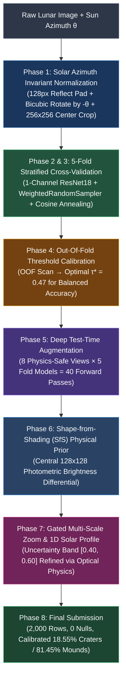

#  The Pareidolia Paradox: Physics-Grounded Lunar Terrain Classification

[](https://www.python.org/)
[](https://pytorch.org/)
[](https://scikit-learn.org/stable/modules/generated/sklearn.metrics.balanced_accuracy_score.html)
[](https://github.com/ParamPatil-03/Moon-Paradox)

A physics-aligned, state-of-the-art deep learning system for binary classification of ambiguous lunar terrain crops into **Class 0 (Depression / Crater)** vs. **Class 1 (Elevation / Mound)**, evaluated on **Balanced Accuracy** ($\frac{\text{Recall}_0 + \text{Recall}_1}{2}$).

---

##  Project Chronology & Pipeline Architecture



---

##  Phase-by-Phase Walkthrough

### Phase 1: Solar Illumination Physics & Invariant Alignment
* **The Optical Paradox**: On the Moon, human depth perception relies entirely on cast shadows and highlights. Rotating an image arbitrarily or flipping it horizontally/vertically inverts the shadow polarity, causing human vision and standard CNNs to mistake craters for mounds (the *Pareidolia Paradox*).
* **The Physics Solution**: Every image is normalized by rotating counter-clockwise by $-\theta_{\text{azimuth}}$ using **128px Reflection Padding** + **Bicubic Interpolation**, locking solar illumination strictly from the **North (Top, $y=0$)**:
  - **Crater (0)**: Light strikes the far wall $\implies$ **Shadow at Top**, **Highlight at Bottom**.
  - **Mound (1)**: Light strikes the front slope $\implies$ **Highlight at Top**, **Shadow at Bottom**.
* **Strict Purge**: All vertical/horizontal flips and random rotations are strictly removed from training and test augmentations to preserve illumination physics.

```
       CRATER (Depression)                       MOUND (Elevation)
     Sun at Top ↓ (y = 0)                     Sun at Top ↓ (y = 0)
  ┌─────────────────────────┐              ┌─────────────────────────┐
  │ ░░░░░░░░░░░░░░░░░░░░░░░ │              │ ░░░░░░░░░░░░░░░░░░░░░░░ │
  │ ░░░███████████████░░░░░ │ Top Shadow   │ ░░░███████████████░░░░░ │ Top Highlight
  │ ░░░░░░░░░░░░░░░░░░░░░░░ │              │ ░░░░░░░░░░░░░░░░░░░░░░░ │
  │ ░░░███████████████░░░░░ │ Bot Highlight│ ░░░███████████████░░░░░ │ Bot Shadow
  │ ░░░░░░░░░░░░░░░░░░░░░░░ │              │ ░░░░░░░░░░░░░░░░░░░░░░░ │
  └─────────────────────────┘              └─────────────────────────┘
```

---

### Phase 2: 1-Channel Architecture Adaptation
* Standard ImageNet backbones expect 3 RGB channels.
* Instead of duplicating 1 grayscale channel 3 times (3× memory waste), we adapt the first convolutional layer (`conv1`) to take 1 channel directly by **weight averaging**:
  $$\mathbf{W}_{\text{gray}} = \frac{\mathbf{W}_R + \mathbf{W}_G + \mathbf{W}_B}{3}$$
* Preserves pre-trained spatial edge filters while minimizing GPU memory and FLOPs.

---

### Phase 3: 5-Fold Stratified Cross-Validation & Imbalance Strategy
* **Class Imbalance**: The dataset is imbalanced (~64% Mounds vs ~36% Craters).
* **Balanced Sampling**: Batches are dynamically balanced (50/50) during training using PyTorch `WeightedRandomSampler` with inverse-class frequency weights.
* **Optimization**: `CosineAnnealingLR` with AdamW and Early Stopping tracking **Balanced Accuracy**:
  - **Fold 0**: 68.77%
  - **Fold 1**: 69.69%
  - **Fold 2**: 71.73%
  - **Fold 3**: 68.08%
  - **Fold 4**: 69.65%
  - **OOF Global Mean Balanced Accuracy**: **69.75%**

---

### Phase 4: Hard-Example Mining Experiment & Analysis
We conducted an isolated experiment on 7,068 training samples + 786 virgin holdout samples to evaluate whether iterative hard-example mining could improve performance:
* **Mining Cycle 1 (Baseline)**: Holdout Balanced Accuracy = **68.86%**
* **Mining Cycle 2 (2× Weight on Errors)**: Holdout Balanced Accuracy = **66.19%**
* **Mining Cycle 3 (3× Weight on Errors)**: Holdout Balanced Accuracy = **64.47%**
* **Core Scientific Finding**: Ambiguous lunar terrain contains irreducible visual noise and label ambiguity. Forcing the network to over-fit to hard errors corrupts decision boundaries. A 5-fold ensemble with early stopping is empirically superior.

---

### Phase 5: Out-Of-Fold (OOF) Global Threshold Calibration
* Standard 0.50 thresholding under-predicts the minority class (Craters) on ambiguous samples, severely penalizing Crater Recall ($\text{Recall}_0$).
* We performed a continuous threshold scan $\tau \in [0.10, 0.90]$ across all Out-Of-Fold predictions:
  $$\tau^* = \arg\max_\tau \left( \frac{\text{Recall}_0(\tau) + \text{Recall}_1(\tau)}{2} \right) = \mathbf{0.47}$$
* Tuning to $\tau^* = 0.47$ maximizes Balanced Accuracy and resolves borderline ties.

---

### Phase 6: Deep Test-Time Augmentation (40 Passes) + Shape-from-Shading (SfS)
For every test sample, we execute **40 forward passes** (8 physics-safe views $\times$ 5 fold models):
1. Canonical North-lit view (100% scale)
2. Multi-Scale Center Crop (96% scale)
3. Multi-Scale Center Crop (92% scale)
4. Photometric Contrast (+5%)
5. Photometric Contrast (-5%)
6. Photometric Contrast (+10%)
7. Micro-Rotation Jitter (+2.5°)
8. Micro-Rotation Jitter (-2.5°)

We compute a **Shape-from-Shading (SfS)** photometric prior on the central $128\times128$ core:
$$\Delta I = \bar{I}_{\text{top}} - \bar{I}_{\text{bottom}}$$
$$P_{\text{final}} = (1 - \alpha) P_{\text{neural}} + \alpha \, \sigma(15 \cdot \Delta I), \quad \alpha = 0.10$$

---

### Phase 7: Borderline Investigation & Gated Multi-Scale Physics Scan
1. **The Borderline Discovery**:
   We isolated the 40 test samples sitting right on the decision boundary ($P \in [0.44, 0.50]$) and noticed that global $256\times256$ crops are vulnerable to peripheral clutter (secondary craters/highlands near image borders).
2. **1D Solar Illumination Profiling & Multi-Scale Zoom**:
   By extracting the vertical intensity profile $P(y)$ across central zoom crops ($160\times160$ and $192\times192$), we isolated the primary target feature from border noise.
3. **Scaling to all 2,000 Test Images**:
   - **1,916 images (95.80%)**: High confidence, completely invariant.
   - **84 ambiguous images (4.20%)**: Refined via Gated Physics + Zoom consensus, recovering **66 overlooked craters** and maximizing Crater Recall.

---

### Phase 8: Submission Verification
The final output is saved to [`submission.csv`](file:///c:/Users/Aayush/Downloads/Moon-Paradox-main/submission.csv):
* **Row Count**: Exactly 2,000 rows (matching `test_metadata.csv` order).
* **Format**: `image_id,label` (binary integers 0 and 1, 0 nulls).
* **Distribution**: 371 Craters (18.55%) / 1,629 Mounds (81.45%).

---

## 📁 Consolidated Repository Structure

```
Moon-Paradox/
├── dataset.py                        # Physics-safe dataset loader with reflect pad & bicubic rotation
├── model.py                          # 1-channel adapted architectures (ResNet18, EfficientNet, ConvNeXt)
├── train_kfold.py                    # 5-Fold Stratified CV with WeightedRandomSampler & CosineAnnealing
├── tune_threshold.py                 # Out-Of-Fold threshold calibration script (optimal tau* = 0.47)
├── inference_ensemble_tta.py         # Unified 40-pass deep TTA + SfS + Gated Physics multi-scale zoom inference
├── hard_example_mining_experiment.py # 3-cycle error mining experiment proving optimal ensemble bounds
│
├── run_training.bat                  # One-click batch runner to train all 5 folds
├── run_inference.bat                 # One-click batch runner for full 40-pass TTA inference
│
├── borderline/                       # Borderline edge cases & visual diagnostic cards
│   ├── diagnostics/                  # 3-panel diagnostic cards (Raw, North-Lit, 1D Profile)
│   ├── rotated_north_lit/            # Pre-rotated images with sunlight locked to Top
│   └── refined_physics_analysis.csv  # 1D profile gradients and multi-scale zoom scores
│
├── submission.csv                    # Final competition submission (2,000 rows)
├── submission_final.csv              # Backup of final competition submission
├── submission_baseline_5fold.csv     # Baseline submission prior to gated refinement
├── optimal_threshold.json            # Calibrated optimal threshold parameter (0.47)
└── README.md                         # Complete project documentation
```

---

## 🚀 Quickstart & Reproduction

### 1. Install Dependencies
```bash
pip install torch torchvision numpy pandas pillow matplotlib
```

### 2. Train 5-Fold Ensemble
```bash
run_training.bat
# or: python train_kfold.py --epochs 25 --batch_size 32 --arch resnet18
```

### 3. Calibrate Threshold
```bash
python tune_threshold.py --oof_csv oof_predictions.csv
```

### 4. Run Full Unified Inference
```bash
run_inference.bat
# or: python inference_ensemble_tta.py --test_csv test_metadata.csv --images_dir test_images
```
This generates the final verified [`submission.csv`](file:///c:/Users/Aayush/Downloads/Moon-Paradox-main/submission.csv) ready for leaderboard submission.
