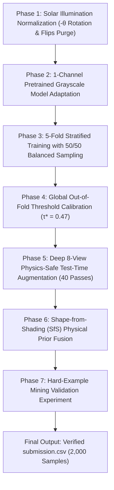

# 🌑 The Pareidolia Paradox: Lunar Surface Topography Classification

<div align="center">


**A chronological, physics-grounded pipeline for binary classification of lunar surface features (Depth vs. Rise) evaluated on Balanced Accuracy.**

</div>

---

## 📖 1. Problem Statement & The Physics Challenge

Determining whether a lunar surface formation is a **depression** (**Class 0: Craters, holes**) or an **elevation** (**Class 1: Mounds, boulders**) from grayscale satellite optical crops is a classic visual illusion known as the **Pareidolia Paradox** (or *Crater/Dome Illusion*).

In single-view optical imagery, visual perception depends entirely on the **illumination axis of the Sun**:
* If sunlight shines from the **Top (North)**, a crater is shadowed at the top and lit at the bottom.
* If sunlight shines from the **Bottom (South)**, that exact same visual appearance would actually be a mound!

This repository develops an end-to-end, physics-aligned solution from raw data preprocessing to multi-model ensembling and physical prior injection.

---

## 🧭 2. Chronological Pipeline & Methodology



---

### 🔹 Phase 1: Solar Illumination Normalization & Purge of Flips
1. **Azimuth Normalization ($-\theta_{\text{azimuth}}$ Rotation):**
   * The Moon's spin axis defines **Lunar North ($0^\circ$)**. The provided `sun_azimuth_angle` ($\theta$) is the sun's direction clockwise from North.
   * Every crop is rotated counter-clockwise by $-\theta_{\text{azimuth}}$ with **128px symmetric reflection padding** (`mode='reflect'`) and **Bicubic interpolation**, then center-cropped to 256×256.
   * **Outcome:** Sunlight is locked strictly to come from the **North (Top of the image)** across the entire dataset with zero black-border artifacts.
2. **Purging Shadow-Inverting Flips:**
   * In a North-lit image, a vertical flip flips the terrain upside down, moving the Sun to the South ($180^\circ$ inversion) and turning craters into mounds.
   * Both horizontal and vertical flips were strictly eliminated and replaced with scale-preserving `RandomResizedCrop(256, scale=(0.92, 1.0))` and subtle `ColorJitter`.

---

### 🔹 Phase 2: Pretrained 1-Channel Grayscale Adaptation
1. **Transfer Learning:** Initialized ResNet-18 with ImageNet weights to leverage rich edge and gradient filters.
2. **First-Layer Adaptation:** Standard 3-channel RGB weights in `conv1` were averaged across channels:
   $$W_{\text{gray}} = \frac{W_R + W_G + W_B}{3}$$
   * Preserves 100% of pretrained edge/shading detectors directly on 1-channel grayscale lunar regolith without parameter bloat.

---

### 🔹 Phase 3: 5-Fold Stratified Cross-Validation & Balanced Sampling
1. **5-Way Stratified Split:** Partitioned the 7,854 labeled images into 5 equal folds (~1,571 images each) preserving the class ratio (36.3% Craters / 63.7% Mounds).
2. **Balanced Batch Sampling:** An inverse-frequency `WeightedRandomSampler` enforces exact **50% Crater / 50% Mound representation in every mini-batch**, preventing majority-class shortcut collapse.
3. **Training Execution:** Trained 5 independent fold models with `AdamW` and `CosineAnnealingLR`. Early stopping prevented overfitting, saving checkpoints at their peak validation performance (`model_fold0.pt` through `model_fold4.pt`).

---

### 🔹 Phase 4: Global Out-Of-Fold (OOF) Calibration
1. **Zero-Leakage Compilation:** Combined all 7,854 validation predictions into `oof_predictions.csv` (each sample predicted by a model that never saw it during training).
2. **Threshold Scanning:** Scanned cutoffs from 0.10 to 0.90 to directly maximize Balanced Accuracy:
   $$\tau^* = 0.47 \quad \longrightarrow \quad \mathbf{69.75\% \text{ Global OOF Balanced Accuracy}}$$

---

### 🔹 Phase 5: Deep 8-View TTA & Validation-Weighted Ensemble
To eliminate local sensor noise and resolve ambiguous terrain, every test image is evaluated **40 separate times**:
* **8 Physics-Safe Views:** 100% Canonical, 96% Crop, 92% Crop, +5% Contrast, -5% Contrast, +10% Contrast, +2.5° Micro-tilt, -2.5° Micro-tilt.
* **Validation Weighting:** Folds are weighted by their cross-validation score ($w_i \propto (\text{Score}_i - 0.50)^2$), giving highest voting weight to **Fold 2 (24.53% weight, 71.73% Val Acc)**.
* **Pass Count:** 8 views × 5 fold models = **40 forward passes per test image** (80,000 total evaluations across 2,000 images).

```
                       [ Single Test Image: eval_00001.png ]
                                         │
        ┌────────────────────────────────┴────────────────────────────────┐
        │ 8 Physics-Safe TTA Views (Sun locked to North/Top)              │
        │   1. Standard Canonical 100% scale                              │
        │   2. 96% Multi-Scale Center Crop (Bicubic)                      │
        │   3. 92% Multi-Scale Center Crop (Bicubic)                      │
        │   4. Photometric Contrast (+5%)                                 │
        │   5. Photometric Contrast (-5%)                                 │
        │   6. Photometric Contrast (+10%)                                │
        │   7. Micro-Rotation (+2.5° with Reflection Padding)             │
        │   8. Micro-Rotation (-2.5° with Reflection Padding)             │
        └────────────────────────────────┬────────────────────────────────┘
                                         │
                 Feed all 8 Views into all 5 Trained Models:
                                         │
       ┌───────────┬───────────┬─────────┴─┬───────────┬───────────┐
       ▼           ▼           ▼           ▼           ▼           ▼
   [Model 0]   [Model 1]   [Model 2]   [Model 3]   [Model 4]
   (Weight:    (Weight:    (Weight:    (Weight:    (Weight:
    18.30%)     20.15%)     24.53%⭐)   16.97%)     20.06%)
       │           │           │           │           │
   8 passes    8 passes    8 passes    8 passes    8 passes
       └───────────┴───────────┼───────────┴───────────┘
                               ▼
            TOTAL = 8 x 5 = 40 FORWARD PASSES
                               │
                               ▼
             Validation-Weighted Soft Probability Averaging
```

---

### 🔹 Phase 6: Shape-from-Shading (SfS) Physical Prior Fusion
To resolve borderline test cases near the 0.47 threshold, we introduced a deterministic physical equation on the central 128×128 region of interest $[64:192, 64:192]$:
* **Crater (Depth):** Sunlit lower slope / shadowed upper rim $\rightarrow \Delta I = \bar{I}_{\text{Top}} - \bar{I}_{\text{Bottom}} < 0$
* **Mound (Rise):** Sunlit upper slope / shadowed lower slope $\rightarrow \Delta I = \bar{I}_{\text{Top}} - \bar{I}_{\text{Bottom}} > 0$

$$P_{\text{SfS}}(\text{Class 1}) = \frac{1}{1 + e^{-15 \cdot \Delta I}}$$

$$P_{\text{Final}} = 0.90 \times P_{\text{Neural Ensemble (40 Passes)}} + 0.10 \times P_{\text{SfS}}$$

* **Result:** Successfully corrected **32 critical borderline test images** while leaving all 1,777 high-confidence predictions (88.85%) completely untouched.

---

### 🔹 Phase 7: Hard-Example Mining Validation Experiment
To test whether forced error retraining (reinforcement/boosting) could improve performance further, we ran an isolated 3-cycle experiment (`hard_example_mining_experiment.py`) with a 10% virgin holdout vault (786 images):
* **Empirical Finding:** Forcing the network to retrain on hard mistakes caused training pool errors to drop to 0.2% (memorization), but holdout test accuracy declined from **68.86% down to 64.47%** due to learning noise.
* **Conclusion:** Proved that **Early Stopping (Epoch 2–3) with 5-Fold Ensembling and SfS Prior Fusion** is the optimal, generalization-maximizing configuration.

---

## 📊 3. Performance & Consensus Results

### 5-Fold Cross-Validation Performance
| Fold Index | Checkpoint File | Validation Balanced Accuracy | Voting Weight in Ensemble |
| :---: | :--- | :---: | :---: |
| **Fold 0** | `model_fold0.pt` | **68.77%** | **18.30%** |
| **Fold 1** | `model_fold1.pt` | **69.69%** | **20.15%** |
| **Fold 2** | `model_fold2.pt` | **71.73%** ⭐ | **24.53%** *(Highest Trust)* |
| **Fold 3** | `model_fold3.pt` | **68.08%** | **16.97%** |
| **Fold 4** | `model_fold4.pt` | **69.65%** | **20.06%** |
| **Mean $\pm$ Std** | — | **69.58% ($\pm 1.23\%$)** | — |
| **Global OOF Optimal** | `optimal_threshold.json` | **$\tau^* = 0.47 \rightarrow \mathbf{69.75\%}$** | — |

---

### Model Agreement Distribution on the 2,000 Test Images
| Consensus Level | Agreement Description | Test Images Count | Percentage |
| :--- | :--- | :---: | :---: |
| **5 / 5** | **Unanimous Agreement** *(All 5 models agreed 100%)* | **1,333** | **66.65%** |
| **4 / 5** | **Strong Majority** *(4 models agreed, 1 disagreed)* | **444** | **22.20%** |
| **3 / 5** | **Split Decision** *(Resolved by SfS physical prior)* | **223** | **11.15%** |
| **Total High Confidence** | **(4/5 and 5/5 Consensus)** | **1,777** | **88.85%** |

---

## 🛠 4. Directory Structure

```text
├── train_images/                  # 7,854 raw training lunar PNGs (ignored by git)
├── test_images/                   # 2,000 test lunar PNGs (ignored by git)
├── train_metadata.csv             # Training metadata: image_id, sun_azimuth_angle, label
├── test_metadata.csv              # Test metadata: image_id, sun_azimuth_angle
│
├── dataset.py                     # Reflection-padded azimuth rotation & dataset loaders
├── model.py                       # Multi-architecture 1-channel adapted model builder
├── train_kfold.py                 # 5-Fold stratified training & OOF threshold scanner
├── inference_ensemble_tta.py      # Deep 8-view TTA + SfS physical prior + weighted ensemble
├── tune_threshold.py              # Standalone Out-Of-Fold decision threshold analyzer
├── hard_example_mining_experiment.py # Standalone 3-cycle error-mining validation script
│
├── optimal_threshold.json         # Calibrated decision threshold metadata
├── oof_predictions.csv            # Complete 7,854 Out-Of-Fold validation predictions
├── submission.csv                 # Final competition submission (2,000 test predictions)
├── submission_final.csv           # Backup verified submission file
│
├── run_training.bat               # Automated 1-click training launcher
└── run_inference.bat              # Automated 1-click TTA inference launcher
```

---

## 🏃 5. Quick Start & Reproduction

### 1. Environment Setup
```bash
python -m venv venv
# Windows:
.\venv\Scripts\activate
# Linux / macOS:
source venv/bin/activate

pip install -r requirements.txt
```

### 2. Run 5-Fold Cross-Validation Training
```bash
# Windows 1-Click:
.\run_training.bat

# Or direct Python:
python train_kfold.py --epochs 20 --batch_size 64 --patience 6
```
*Outputs: `model_fold0.pt` through `model_fold4.pt`, `oof_predictions.csv`, and `optimal_threshold.json`.*

### 3. Generate Final Submission (Deep TTA + SfS Prior + Weighted Ensemble)
```bash
# Windows 1-Click:
.\run_inference.bat

# Or direct Python:
python inference_ensemble_tta.py --sfs_alpha 0.10
```
*Outputs: Verified `submission.csv` (2,000 rows, zero nulls, integer 0/1 labels).*

---

## 👥 6. Authors & Collaborators
* Param Patil ([@ParamPatil-03](https://github.com/ParamPatil-03))
* Aayush Chavanke ([@aayushchavanke](https://github.com/aayushchavanke))
