# 🌕 The Pareidolia Paradox: Physics-Grounded Lunar Terrain Classification

[](https://www.python.org/)
[](https://pytorch.org/)
[](https://scikit-learn.org/stable/modules/generated/sklearn.metrics.balanced_accuracy_score.html)
[](https://github.com/ParamPatil-03/Moon-Paradox)
[](https://docs.google.com/forms/d/e/1FAIpQLSdqczbWyr0KwitRAb3waarjIpYOPykO_nzLpd1pEsTRNUmlLw/viewform)

A physics-aligned, state-of-the-art deep learning system for binary classification of ambiguous lunar terrain crops into **Class 0 (Depression / Crater)** vs. **Class 1 (Elevation / Mound)**, evaluated on **Balanced Accuracy** ($\frac{\text{Recall}_0 + \text{Recall}_1}{2}$).

---

## 🧭 Executive Summary & Competition Deliverables Checklist

| Deliverable | Required File | Description | Status |
|---|---|---|:---:|
| **1. Predictions CSV** | [`submission.csv`](file:///c:/Users/Aayush/Downloads/Moon-Paradox-main/submission.csv) | Exactly 2,000 prediction rows (`image_id,label`), 0 nulls | **VERIFIED ✅** |
| **2. Training Entrypoint** | [`train.py`](file:///c:/Users/Aayush/Downloads/Moon-Paradox-main/train.py) | Full 5-fold cross-validation training pipeline | **VERIFIED ✅** |
| **3. Inference Entrypoint** | [`inference.py`](file:///c:/Users/Aayush/Downloads/Moon-Paradox-main/inference.py) | 40-Pass TTA + Gated Physics multi-scale zoom pipeline | **VERIFIED ✅** |
| **4. Dependencies** | [`requirements.txt`](file:///c:/Users/Aayush/Downloads/Moon-Paradox-main/requirements.txt) | Minimal, reproducible environment specification | **VERIFIED ✅** |
| **5. Documentation** | [`README.md`](file:///c:/Users/Aayush/Downloads/Moon-Paradox-main/README.md) | Complete methodology, architecture diagrams, reproduction | **VERIFIED ✅** |
| **6. Model Checkpoints** | `model_fold0.pt` – `model_fold4.pt` | PyTorch checkpoint weights with validation metadata | **VERIFIED ✅** |

---

## 🏗️ End-to-End Pipeline Architecture

```mermaid
flowchart TD
    A["Raw Lunar Image (256x256) + Sun Azimuth θ"] --> B["Phase 1: Solar Invariant Alignment<br/>(128px Reflect Pad + Bicubic Rotate by -θ + 256x256 Center Crop)"]
    B --> C["Phase 2: 3-Channel Physics Tensor Construction<br/>Ch0: Intensity I | Ch1: Solar Slope ∇y I | Ch2: Curvature ∇² I"]
    C --> D["Phase 3: Semi-Supervised Domain Adaptation<br/>(7,854 Ground Truth + High-Confidence Test Pseudo-Labels)"]
    D --> E["Phase 4: 5-Fold Stratified Cross-Validation<br/>(Pretrained ResNet18 + WeightedRandomSampler + Cosine Annealing)"]
    E --> F["Phase 5: Out-Of-Fold Threshold Calibration<br/>(OOF Scan → Optimal τ* = 0.47 for Balanced Accuracy)"]
    F --> G["Phase 6: Deep Test-Time Augmentation (40 Passes)<br/>(8 Physics-Safe Views × 5 Fold Models = 80,000 Passes Total)"]
    G --> H["Phase 7: Shape-from-Shading (SfS) Physical Prior<br/>(Central 128x128 Photometric Brightness Differential ΔI)"]
    H --> I["Phase 8: Gated Multi-Scale Center Zoom Refinement<br/>(Uncertainty Band [0.40, 0.60] Resolved via 1D Solar Profile)"]
    I --> J["Phase 9: Final Verified Submission<br/>(2,000 Rows, 0 Nulls, Calibrated 18.55% Craters / 81.45% Mounds)"]

    style A fill:#2D3748,stroke:#4A5568,color:#fff
    style B fill:#1A365D,stroke:#2B6CB0,color:#fff
    style C fill:#2B6CB0,stroke:#63B3ED,color:#fff
    style D fill:#285E61,stroke:#319795,color:#fff
    style E fill:#22543D,stroke:#38A169,color:#fff
    style F fill:#744210,stroke:#D69E2E,color:#fff
    style G fill:#44337A,stroke:#805AD5,color:#fff
    style H fill:#2A4365,stroke:#3182CE,color:#fff
    style I fill:#702459,stroke:#B83280,color:#fff
    style J fill:#1C4532,stroke:#48BB78,color:#fff
```



---

## 🔬 Scientific Methodology: Handling the `sun_azimuth_angle`

On the Moon, where there is no atmosphere to scatter light, human depth perception relies strictly on shadows and highlights. Without illumination normalization, a crater lit from the bottom produces the exact same shadow pattern as a mound lit from the top—the classic optical *Pareidolia Paradox*.

### 1. Invariant Alignment Mechanics
1. **Reflection Padding**: Each $256\times256$ crop is padded with 128 pixels on all 4 sides (`mode='reflect'`) to prevent black corner boundary artifacts during rotation.
2. **Bicubic Rotation**: The image is rotated counter-clockwise by $-\theta_{\text{azimuth}}$ using **Bicubic interpolation** to preserve high-frequency shadow sharpness.
3. **Center Cropping**: Cropped back to the canonical $256\times256$ window.
4. **Result**: Solar rays are locked to originate strictly from **North (Top, $y=0$)**:

```
       CRATER (Depression)                       MOUND (Elevation)
     Sun at Top ↓ (y = 0)                     Sun at Top ↓ (y = 0)
  ┌─────────────────────────┐              ┌─────────────────────────┐
  │ ░░░░░░░░░░░░░░░░░░░░░░░ │              │ ░░░░░░░░░░░░░░░░░░░░░░░ │
  │ ░░░███████████████░░░░░ │ Top Shadow   │ ░░░███████████████░░░░░ │ Top Highlight
  │ ░░░░░░░░░░░░░░░░░░░░░░░ │              │ ░░░░░░░░░░░░░░░░░░░░░░░ │
  │ ░░░███████████████░░░░░ │ Bot Highlight│ ░░░███████████████░░░░░ │ Bot Shadow
  │ ░░░░░░░░░░░░░░░░░░░░░░░ │              │ ░░░░░░░░░░░░░░░░░░░░░░░ │
  └─────────────────────────┘              └─────────────────────────┘
  Top Shadow + Bottom Highlight            Top Highlight + Bottom Shadow
```

### 2. Strict Purge of Physics-Breaking Augmentations
- **Vertical Flips**: STRICTLY PURGED. Flipping vertically moves the sun from North to South, inverting shadow polarity by $180^\circ$ and turning craters into mounds.
- **Horizontal Flips**: STRICTLY PURGED. Mirrors directional sun vectors.
- **Only Physics-Safe Augmentations Allowed**: Multi-scale center crops ($96\%$, $92\%$), micro-rotations ($\pm 2.5^\circ$), and photometric contrast adjustments.

---

## 🧠 3-Channel Physics Tensors & Multi-Backbone Modeling

Rather than passing a 1-channel grayscale image and forcing the neural network to guess terrain slopes, we compute a **3-Channel Physics Tensor** on the fly:
- **Channel 0 (Intensity $I$)**: Normalized surface albedo.
- **Channel 1 (Solar Slope $\nabla_y I$)**: Vertical Sobel gradient $\frac{\partial I}{\partial y}$. Positive for sunlit slopes, negative for shadowed basins.
- **Channel 2 (Curvature $\nabla^2 I$)**: 2D Laplacian operator capturing crater rim ridges vs flat mare terrain.

```
Grayscale 256x256 ──► [ Ch 0: Intensity I       ] ──► Pretrained 3-Channel ResNet-18
                      [ Ch 1: Solar Slope ∇y I  ]
                      [ Ch 2: Curvature ∇² I    ]
```

---

## 📊 Cross-Validation & Out-Of-Fold Threshold Tuning

* **Class Imbalance**: The dataset is naturally skewed (~64% Mounds vs ~36% Craters).
* **Batch Balancing**: `WeightedRandomSampler` dynamically balances every training batch 50/50.
* **5-Fold Stratified CV Results**:
  - **Fold 0**: 68.77%
  - **Fold 1**: 69.69%
  - **Fold 2**: **71.73%**
  - **Fold 3**: 68.08%
  - **Fold 4**: 69.65%
  - **OOF Global Mean Balanced Accuracy**: **69.75%**
* **Optimal Threshold ($\tau^* = 0.47$)**: Continuous threshold scanning on Out-Of-Fold predictions proved $\tau^* = 0.47$ maximizes Balanced Accuracy ($\frac{\text{Recall}_0 + \text{Recall}_1}{2}$) by preventing the model from under-predicting the minority class.

---

## 🎯 Gated Multi-Scale Center Zoom & 1D Solar Profiling

On global $256\times256$ crops, peripheral terrain clutter (e.g. secondary craters or highlands near image borders) can pull predictions into the uncertain middle ($P \in [0.40, 0.60]$).

We deployed a **Gated Physics Tiebreaker**:
1. **High-Confidence Samples (95.8% of test set)**: 5-fold ensemble predictions are 100% locked and protected.
2. **Uncertainty Band ($P \in [0.40, 0.60]$)**: The model zooms into the central $160\times160$ and $192\times192$ core, measuring the vertical 1D solar illumination profile $\Delta I = \bar{I}_{\text{top}} - \bar{I}_{\text{bottom}}$.
3. **Consensus**: Recovered **66 overlooked craters** while maintaining 95.8% stability across the test set.

---

## 📁 Consolidated Repository Structure

```
Moon-Paradox/
├── train.py                          # Official training entry point (runs 5-fold CV)
├── inference.py                      # Official inference entry point (runs 40-pass TTA + Gated Physics)
├── requirements.txt                  # Python dependencies
├── README.md                         # Complete project documentation & methodology
│
├── dataset.py                        # Physics-safe dataset loader with reflect pad, bicubic rotate & 3ch tensors
├── model.py                          # 1-channel & 3-channel adapted architectures (ResNet18, ConvNeXt, EfficientNet)
├── train_kfold.py                    # 5-Fold Stratified Cross-Validation engine with WeightedRandomSampler
├── tune_threshold.py                 # Out-Of-Fold threshold calibration script (optimal tau* = 0.47)
├── inference_ensemble_tta.py         # Unified 40-pass TTA + SfS + Gated Physics inference engine
├── hard_example_mining_experiment.py # 3-cycle error mining experiment proving optimal ensemble bounds
│
├── run_training.bat                  # One-click batch runner to train all 5 folds
├── run_inference.bat                 # One-click batch runner for full 40-pass TTA inference
│
├── borderline/                       # Borderline edge cases & visual diagnostic cards
│   ├── diagnostics/                  # 3-panel diagnostic cards (Raw, North-Lit, 1D Profile)
│   ├── rotated_north_lit/            # Pre-rotated images with sunlight locked to Top
│   └── refined_physics_analysis.csv  # 1D profile gradients and multi-scale zoom scores
│
├── submission.csv                    # Final verified competition submission (2,000 rows)
├── submission_final.csv              # Backup of final competition submission
├── optimal_threshold.json            # Calibrated optimal threshold parameter (0.47)
└── train_metadata.csv, test_metadata.csv # Competition metadata files
```

---

## 🚀 Reproduction Quickstart

### 1. Install Dependencies
```bash
pip install -r requirements.txt
```

### 2. Train 5-Fold Ensemble
```bash
python train.py
# or: run_training.bat
```

### 3. Generate Verified Submission
```bash
python inference.py
# or: run_inference.bat
```
This produces [`submission.csv`](file:///c:/Users/Aayush/Downloads/Moon-Paradox-main/submission.csv) containing exactly 2,000 predictions, verified with 0 nulls, matching all competition specifications.

---

## 🏆 Final Submission Summary
* **Submission File**: `submission.csv` (2,000 rows, headers `image_id,label`)
* **Distribution**: 371 Craters (18.55%) / 1,629 Mounds (81.45%)
* **Model Checkpoints**: `model_fold0.pt` – `model_fold4.pt` (Saved with best validation metrics)
* **GitHub Repository**: `https://github.com/ParamPatil-03/Moon-Paradox`
